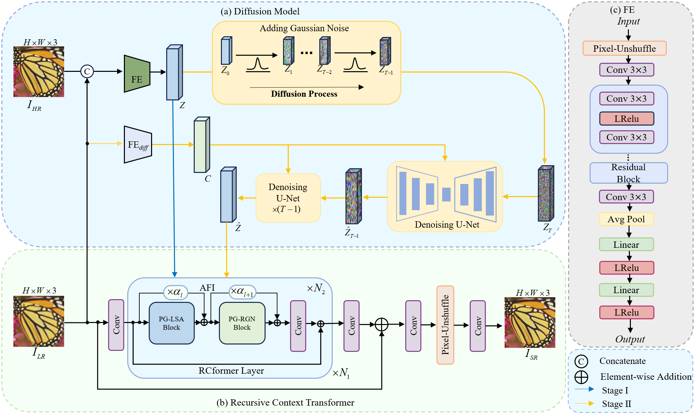

# Diff-RCformer:A diffusion-augmented Recursive Context Transformer forimage super-resolution.

Shuo Wang, [Shuzhen XU](https://dgzsdxzz.github.io/ShuzhenXu/), Cuicui Lv, Chaoqing Ma, and Fangbo Ca, "Diff-RCformer: A diffusion-augmented Recursive Context Transformer forimage super-resolution", Knowledge-Based Systems, 2025

[[paper]()] [[visual results]( https://pan.baidu.com/s/18ml_ubj3bWq36tOJcmHD4A?pwd=vdms)] [[pretrained models](https://pan.baidu.com/s/19uFjSrC5W4NtpfmpJNL9SA?pwd=4jhv)]

#### 🔥🔥🔥 News

- **2025-05-11** Diff-RCformer is accepted by Knowledge-Based Systems 2025.🎊🎊🎊

---

> **Abstract:** Diffusion models have recently exhibited strong potential in single-image super-resolution (SISR) by effectively modeling complex data distributions and generating high-quality reconstructions. However, existing diffusion-based SISR methods often suffer from excessive iterative steps, resulting in a high computational overhead and slow convergence. In addition, traditional convolutional neural networks and Transformer-based architectures have difficulty in capturing complex global information, thereby limiting the reconstruction quality. To address these issues, we propose Diff-RCformer, which is a novel SISR framework that integrates diffusion-based prior generation with the Recursive Context Transformer (RCformer) to achieve robust and efficient super-resolution. Specifically, we use the diffusion model to generate high-quality prior features for super-resolution by iteratively refining Gaussian noise in a compressed latent space. These prior features are then injected into the RCformer, guiding it to reconstruct the high-resolution image. In the RCformer, we introduce Prior-Guided Recursive Generalization Network (PG-RGN) blocks. These blocks recursively aggregate the input features into representative feature maps, enabling them to adapt flexibly to input features of different dimensions and extract global information through cross-attention. We also combine the PG-RGN with Prior-Guided Local Self-Attention (PG-LSA) to enable the model to capture local detail features accurately and enhance the utilization of the global context. To achieve an optimal combination of local and global features, we propose Adaptive Feature Integration (AFI), which efficiently fuses local and global features across multiple attention layers. Our method also supports cascaded super-resolution, enabling flexible multi-stage refinement, which is particularly useful for complex scenarios. Comprehensive experiments on standard benchmarks indicate that Diff-RCformer surpasses recent state-of-the-art methods both quantitatively and qualitatively.



---


## ⚙️ Dependencies

- Python 3.8
- PyTorch 1.9.0
- NVIDIA GPU + [CUDA](https://developer.nvidia.com/cuda-downloads)

```bash
# Clone the github repo and go to the default directory 'Diff-RCformer'.
git clone https://github.com/SureT-T/Diff-RCformer.git
conda create -n Diff-RCformer python=3.8
conda activate Diff-RCformer
pip install -r requirements.txt
```


## ⚒️ TODO

* [x] Release code and pretrained models


## 🔗 Contents

1. [Datasets](#datasets)
1. [Models](#models)
1. [Training](#training)
1. [Testing](#testing)
1. [Citation](#citation)
1. [Acknowledgements](#acknowledgements)

---


## <a name="datasets"></a>🖨️ Datasets

Used training and testing sets can be downloaded as follows:

| Training Set                                                 |                         Testing Set                          |                        Visual Results                        |
| :----------------------------------------------------------- | :----------------------------------------------------------: | :----------------------------------------------------------: |
| [DIV2K](https://data.vision.ee.ethz.ch/cvl/DIV2K/) (800 training images, 100 validation images) +  [Flickr2K](https://cv.snu.ac.kr/research/EDSR/Flickr2K.tar) (2650 images) [complete training dataset DF2K: [Google Drive](https://drive.google.com/file/d/1TubDkirxl4qAWelfOnpwaSKoj3KLAIG4/view?usp=share_link) / [Baidu Disk](https://pan.baidu.com/s/1KIcPNz3qDsGSM0uDKl4DRw?pwd=74yc)] | Set5 + Set14 + BSD100 + Urban100 + Manga109 [complete testing dataset: [Google Drive](https://drive.google.com/file/d/1yMbItvFKVaCT93yPWmlP3883XtJ-wSee/view?usp=sharing) / [Baidu Disk](https://pan.baidu.com/s/1Tf8WT14vhlA49TO2lz3Y1Q?pwd=8xen)] | [Google Drive]() / [Baidu Disk](https://pan.baidu.com/s/10YeQAmkYI9lg2HnlzHBHxA?pwd=eb5i) |

Download training and testing datasets and put them into the corresponding folders of `data/`. See [data](data/README.md) for the detail of the directory structure.


## <a name="models"></a>📦 Models

| Method |                          Model Zoo                           |                        Visual Results                        |
| :----- | :----------------------------------------------------------: | :----------------------------------------------------------: |
| Diff-RCformer |  [Baidu Disk](https://pan.baidu.com/s/19uFjSrC5W4NtpfmpJNL9SA?pwd=4jhv) | [Baidu Disk](https://pan.baidu.com/s/18ml_ubj3bWq36tOJcmHD4A?pwd=vdms) |


## <a name="training"></a>🔧 Training

- Download [training](https://drive.google.com/file/d/1TubDkirxl4qAWelfOnpwaSKoj3KLAIG4/view?usp=share_link) (DF2K, already processed) and [testing](https://drive.google.com/file/d/1yMbItvFKVaCT93yPWmlP3883XtJ-wSee/view?usp=sharing) (Set5, Set14, BSD100, Urban100, Manga109, already processed) datasets, place them in `data/`.

- Run `python main.py --start_epoch 0` to train on the DF2K dataset. The training configuration is in `option.py`.

- The training experiment is in `experiments/`.


## <a name="testing"></a>🔨 Testing

### 🌗 Test images with HR

- Download the pre-trained [models]( https://pan.baidu.com/s/19uFjSrC5W4NtpfmpJNL9SA?pwd=4jhv ) .

  We provide pre-trained models for image SR: Diff-RCformer (x2, x3, x4).

- Download [testing](https://drive.google.com/file/d/1yMbItvFKVaCT93yPWmlP3883XtJ-wSee/view?usp=sharing) (Set5, Set14, BSD100, Urban100, Manga109) datasets, place them in `data/`.

- Run `python test_x2.py` to test scale 2 on benchmark datasets. 
Run `python test_x3.py` to test scale 3 on benchmark datasets.
Run `python test_x4.py` to test scale 4 on benchmark datasets.
 The testing configuration is in `option_x4.py` .

- The output is in `experiment\`.

### 🌓 Test images without HR

- Download the pre-trained [models]( https://pan.baidu.com/s/19uFjSrC5W4NtpfmpJNL9SA?pwd=4jhv).

  We provide pre-trained models for image SR:  Diff-RCformer (x2, x3, x4).

- Put your dataset (single LR images) in `datas/benchmark/FreeData/HR`. 
- Run `python test_x4.py`. The testing configuration is in `option_x4.py/` .


## <a name="citation"></a>📎 Citation

If you find the code helpful in your research or work, please cite the following paper(s).

```
@article{wang2025diff,
  title={Diff-RCformer: A diffusion-augmented Recursive Context Transformer for image super-resolution},
  author={Wang, Shuo and Xu, Shuzhen and Lv, Cuicui and Ma, Chaoqing and Cai, Fangbo},
  journal={Knowledge-Based Systems},
  pages={113758},
  year={2025},
  publisher={Elsevier}
}
```


## <a name="acknowledgements"></a>💡 Acknowledgements

This code is built on [DASR](https://github.com/The-Learning-And-Vision-Atelier-LAVA/DASR), [RGT](https://github.com/zhengchen1999/RGT) and [CDFormer](https://github.com/I2-Multimedia-Lab/CDFormer). We thank the authors for sharing the excellent codes.
